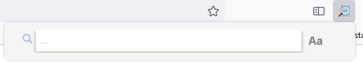
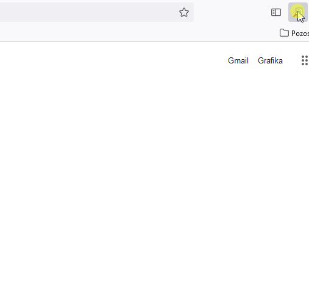

    <h1 align="center">
        
        Search for Tab
    </h1>

    Easily search for a certain tab you have open among many

    
    
    

This project is the Mozilla Firefox extension plugin.
 This plugin allows to find a tab with given title, phrase or url and quickly navigate to it.

---

## Installation & Usage ##

This extension can be installed by:
* installing it via the Mozilla add-ons market by clicking the button bellow: 
* downloading it directly from the [Releases page](https://github.com/BartoszKlonowski/search-for-tab/releases) and install it manually in your browser

After installing you will see the icon opening the extension popup.

| | |
|:-|:-:|
| The popup, in it's basic state contains the text input field to enter the searching phrase. |  |
| The search can be done:  **by the tab's title** - the text visible on the tab right to the website icon  or  **by the URL of the website** the tab has loaded. Bu default the search phrase is case insensitive, but to enable the case matching click on the `Aa` icon to the right of text input field. ||

**To navigate** to a tab when scrolling through the search results, simply click on it.

**To close** the tab from the search results list by click the `X` icon on the right of the tab's tile.

---

## Translations and accessibility ##

This add-on is provided with tooltips and hints translated to several languages.
 However, if you see that your language is not supported or any lack of accessibility suport please report this by creating an [issue](https://github.com/BartoszKlonowski/search-for-tab/issues/new).
 Or you can provide the support to specific language or accessibility by making a [pull request](https://github.com/BartoszKlonowski/search-for-tab/compare) (please see further for how to develop this extension).

---

## Development ##

If you plan to implement changes to this extension:

1. Clone your fork of this repository
2. Run `npm install` in the root of this repository to install all the dependencies and tools Please make sure to have the `npm` installed first.
3. Implement your changes and test them:
 Manually by following [these steps](https://extensionworkshop.com/documentation/develop/debugging/)
 Or automatically by running `npm run test` and `npm run build` in the root of your clone

